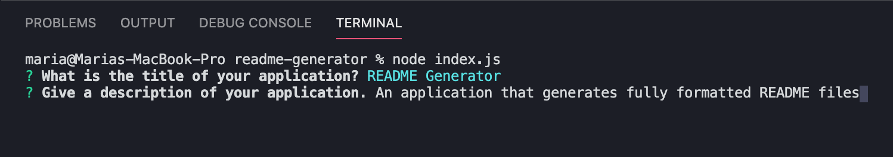
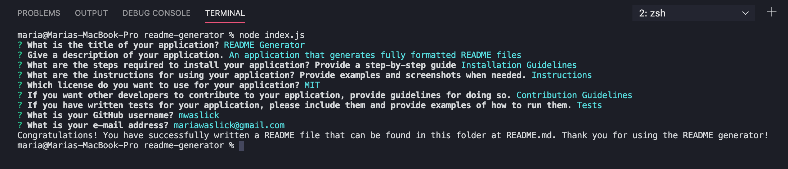
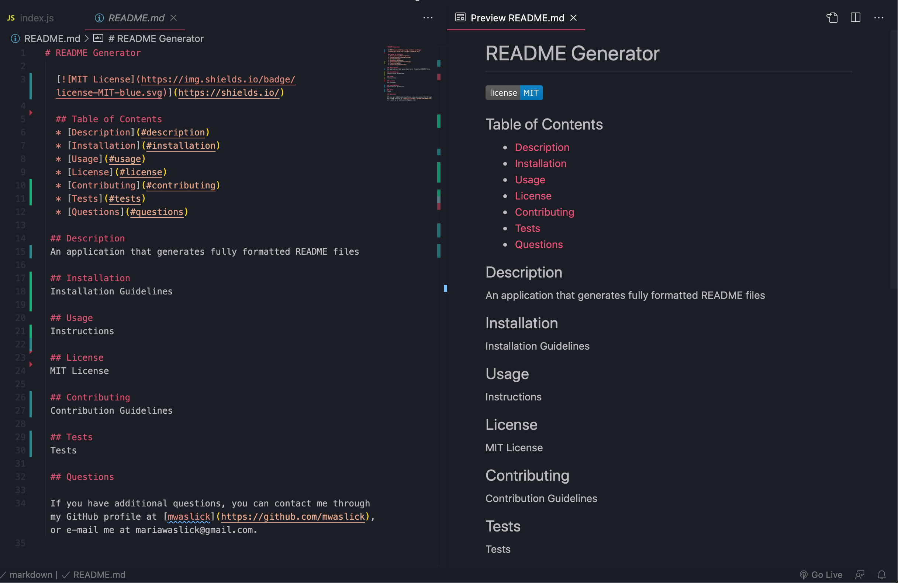

# README Generator

> A README is an essential part of posting a finished application, as potential users should know a great deal of information about an application before using it. This README Generator uses Node.js to generate README by prompting users for the different aspects of their README, and then writing their answers to a fully formatted Markdown file.

  ## Table of Contents
  * [Description](#description)
  * [Installation](#installation)
  * [Usage](#usage)
  * [Screenshots](#screenshots)
  * [License](#license)
  * [Questions](#questions)

 ## Description
 Although READMEs are a significant necessity for any finished project, the Markdown formatting can be difficult for new developers. In order to make the process of creating a README easier, the README Generator uses node.js and the node packages inquirer.js and util.js to generate a fully formatted README Markdown file based on user input. This file has the options to include a table of contents, a project description, directions for installation, directions for usage, information about the license used, instructions for contributing, instructions for tests, and a section for the user to include their GitHub username and e-mail in case others have further questions.

 ## Usage 
 
 When the application is run by using "node index.js", the user is presented with a series of prompts using inquirer.js. These prompts ask the user to subsequently type in their project's title, description, installation instructions, usage instructions, license information, directions for contributing, directions for texts, GitHub username, and e-mail address. After the user has finished typing the information for one prompt, they can press "enter", and will be presented with the next prompt. Once the user has answered all of the README prompts, the program will generate a formatted Markdown code using text from the user's answers, which will be displayed in the README under their respective sections. The generator then writes this code to a file entitled "README.md", and a message stating the README was generated successfully will be logged to the console.

 You can also view an instructional video on how to use the application [here](https://drive.google.com/file/d/1mAcbpCE6_zyx4liS264hSHHias8IOrfv/view?usp=sharing)!

 ## Screenshots

The README Generator beginning to ask the user its prompts

 
Images of the generator when it has finished generating prompts for the user and sends the message stating the README has been written

An example of a fully generated README written by the program

 
 ## License
 
 MIT License

Copyright (c) 2020 Maria Waslick

Permission is hereby granted, free of charge, to any person obtaining a copy
of this software and associated documentation files (the "Software"), to deal
in the Software without restriction, including without limitation the rights
to use, copy, modify, merge, publish, distribute, sublicense, and/or sell
copies of the Software, and to permit persons to whom the Software is
furnished to do so, subject to the following conditions:

The above copyright notice and this permission notice shall be included in all
copies or substantial portions of the Software.

THE SOFTWARE IS PROVIDED "AS IS", WITHOUT WARRANTY OF ANY KIND, EXPRESS OR
IMPLIED, INCLUDING BUT NOT LIMITED TO THE WARRANTIES OF MERCHANTABILITY,
FITNESS FOR A PARTICULAR PURPOSE AND NONINFRINGEMENT. IN NO EVENT SHALL THE
AUTHORS OR COPYRIGHT HOLDERS BE LIABLE FOR ANY CLAIM, DAMAGES OR OTHER
LIABILITY, WHETHER IN AN ACTION OF CONTRACT, TORT OR OTHERWISE, ARISING FROM,
OUT OF OR IN CONNECTION WITH THE SOFTWARE OR THE USE OR OTHER DEALINGS IN THE
SOFTWARE.

 ## Questions

 If you have additional questions, you can contact me through my GitHub profile at [mwaslick](https://github.com/mwaslick), or e-mail me at mariawaslick@gmail.com.
